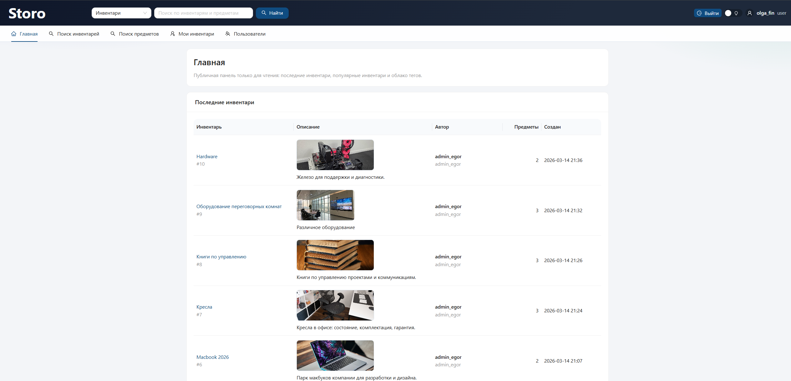
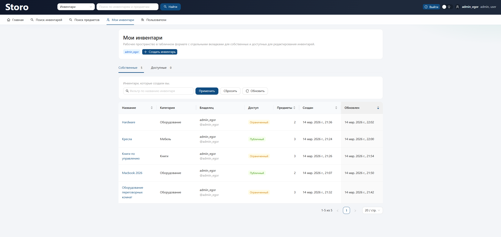
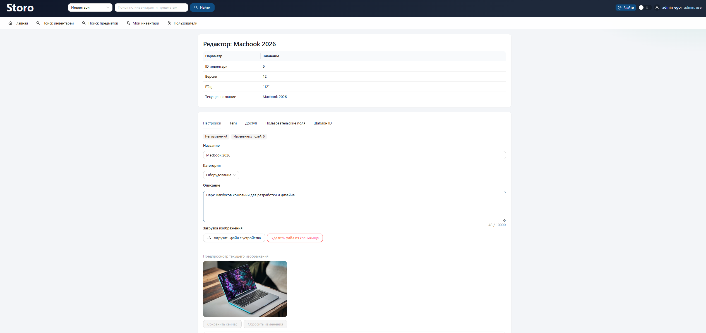
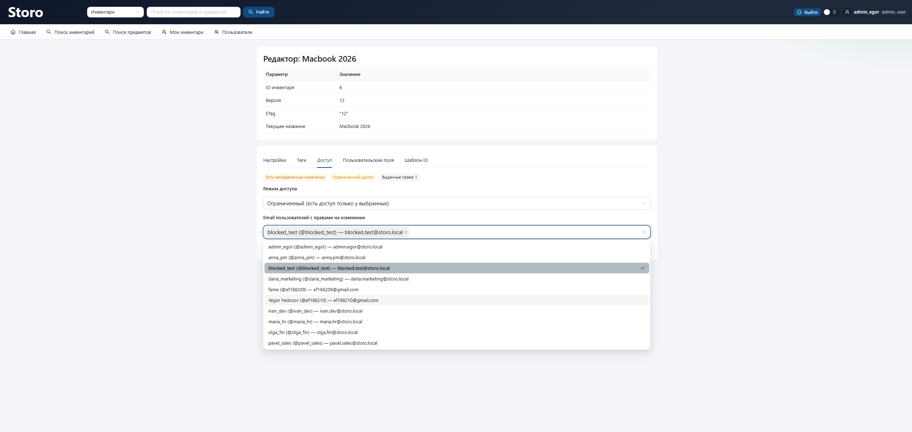
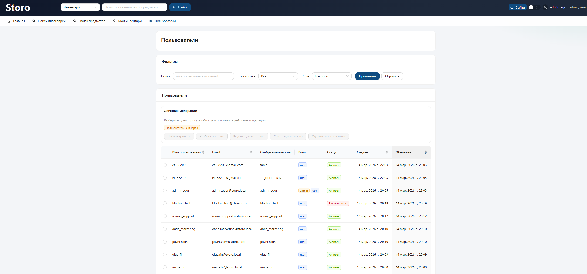
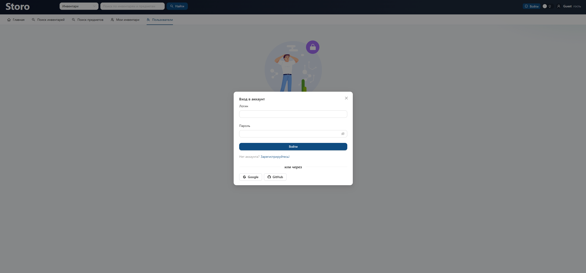

# Storo

Storo — веб-приложение для управления инвентарями: создание шаблонов и предметов, поиск, доступ, обсуждения и администрирование пользователей.

## Демо

- Frontend: `https://storo-9sy7.onrender.com`
- Backend API: `https://storo-backend-latest.onrender.com`
- Swagger: `https://storo-backend-latest.onrender.com/swagger`

## Возможности

- Создание и редактирование инвентарей (настройки, теги, пользовательские поля, шаблон ID).
- Работа с предметами инвентаря и карточками деталей.
- Глобальный поиск по инвентарям и предметам.
- Главная страница со списком последних/популярных инвентарей и облаком тегов.
- Авторизация и регистрация:
  - логин/пароль;
  - Google OAuth;
  - GitHub OAuth.
- Роли и доступ:
  - `guest`, `user`, `admin`;
  - управление пользователями (блокировка, роли, удаление);
  - настройка доступа к инвентарю по пользователям (в UI выбор по email).
- Реальное время для обсуждений (SignalR).
- Настройки интерфейса: светлая/темная тема.

## Технологический стек

- Frontend: `React 19`, `TypeScript`, `Vite`, `Ant Design`.
- Backend: `ASP.NET Core (.NET 10)`, `EF Core`, `Npgsql`, `SignalR`.
- База данных: `PostgreSQL`.
- Хранение файлов: `Supabase Storage`.
- Контейнеризация: `Docker`, `Docker Compose`.
- Хостинг: `Render` (frontend + backend + PostgreSQL).

## Структура проекта

- `frontend/` — клиентское приложение, сборка и `nginx`-конфигурация.
- `backend/backend/` — API, доменная и прикладная логика.
- `docker-compose.yml` — локальный запуск сервисов.

## Локальный запуск (Docker)

1. Подготовить env для backend:

```powershell
Copy-Item backend/backend/.env.example backend/backend/.env
```

2. Заполнить `backend/backend/.env`:

- `ConnectionStrings__Postgres`
- `Authentication__Google__ClientId`
- `Authentication__Google__ClientSecret`
- `Authentication__GitHub__ClientId`
- `Authentication__GitHub__ClientSecret`
- `Auth__ExternalProviders__0=google`
- `Auth__ExternalProviders__1=github`
- `SUPABASE_URL`
- `SUPABASE_BUCKET`
- `SUPABASE_PUBLIC_KEY`
- `SUPABASE_SECRET_KEY`

3. Запустить:

```bash
docker compose up -d --build --force-recreate
```

4. Проверить:

- Frontend: `http://localhost:5173`
- Backend: `http://localhost:5108`
- Swagger: `http://localhost:5108/swagger`

## Скриншоты


### Главная



### Мои инвентари



### Редактор инвентаря



### Доступ к инвентарю



### Пользователи



### Вход


